# 💳 Loan Repayment Risk Prediction

Predicting whether a borrower will repay their loan using historical loan, payment and underwriting data. The goal is to help improve customer pricing and reduce portfolio losses by flagging high-risk applicants before money is disbursed.

---

## 📁 Dataset

Three real-world datasets provided by MoneyLion:

| File | Description |
|------|-------------|
| `loan.csv` | Applicant details and loan outcomes |
| `payment.csv` | Per-loan payment history |
| `clarity_underwriting_variables.csv` | Third-party background check / fraud data |

> ⚠️ Datasets are not included in this repo as they are proprietary to MoneyLion.

---

## 🔍 Problem Definition

The raw data has no direct target variable. A binary `loan_repaid` label was engineered from `loanStatus`:

| Label | Statuses |
|-------|----------|
| ✅ Good (1) | Paid Off, Settlement Paid Off, Charged Off Paid Off, Pending Paid Off |
| ❌ Bad (0) | External Collection, Internal Collection, Returned Item, Settled Bankruptcy, Charged Off |
| ⏳ Excluded | New Loan (outcome still unknown - removed to avoid noise) |

---

## 📊 Exploratory Data Analysis

### Loan Repayment Distribution

Nearly 60% of funded loans defaulted - accurately identifying risky applicants upfront is critical to reducing this loss rate.

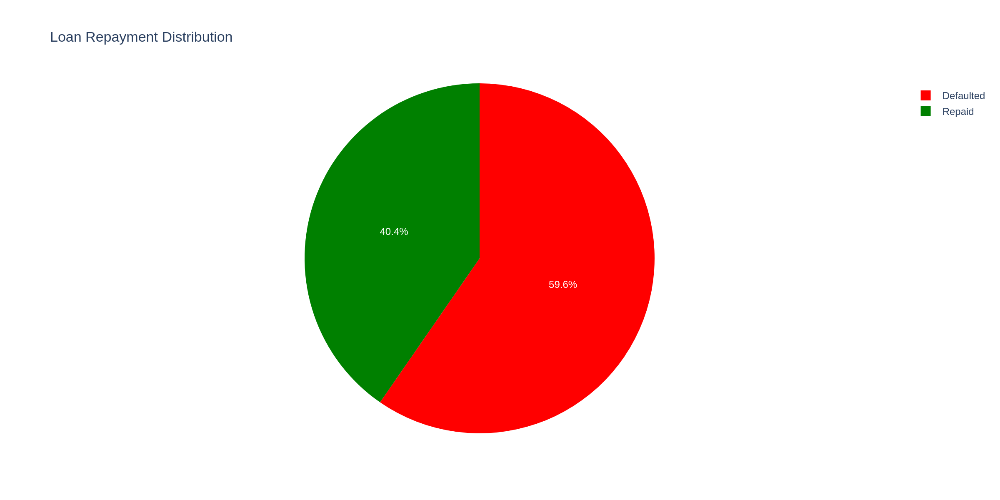

---

### Loan Amount Distribution by Repayment Outcome

Defaults are heavily concentrated in lower loan amounts ($200–$600), but the default rate remains high across all brackets.

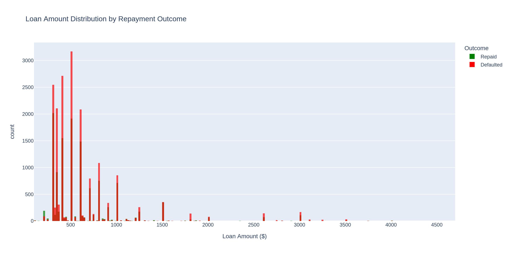

---

### Repayment Rate by Payment Frequency

Weekly payers repay least often (37%) while irregular payers have the highest repayment rate (69%) - suggesting weekly payers may be living paycheck to paycheck, making them higher risk.

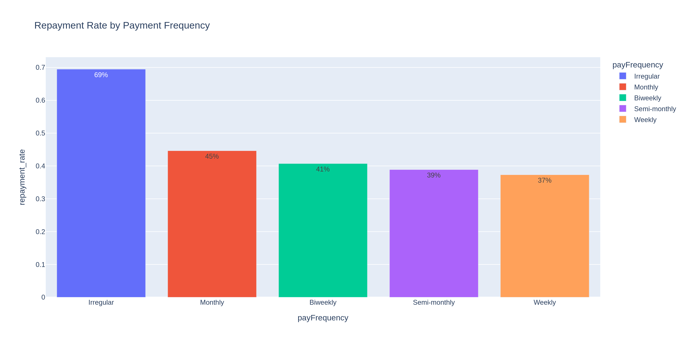

---

### Repayment Rate by Lead Type

Existing MoneyLion customers (instant-offer, lionpay) repay at 100%, while cold leads (bvMandatory, lead) repay at only 34–35%. Loyalty signals reliability.

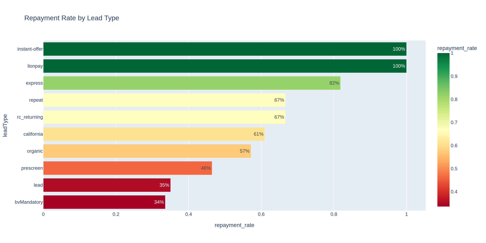

---

### Top 10 States by Loan Volume

Illinois and Wisconsin lead with 54% repayment rates. Florida and Texas lag significantly at 28–29%, useful for geographic risk pricing.

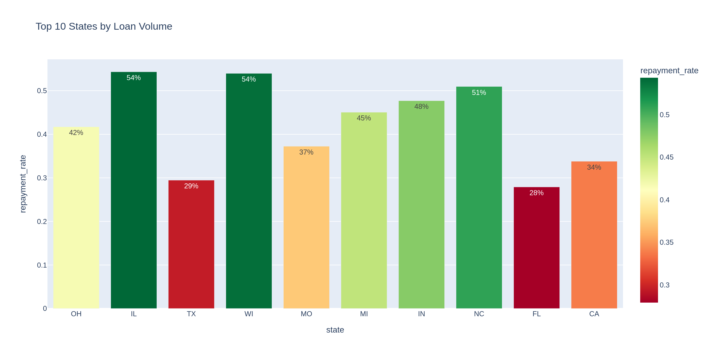

---

### Payment Status Breakdown

Over 270k payments were cancelled and 32k rejected out of ~525k total payment records - indicating widespread repayment friction.

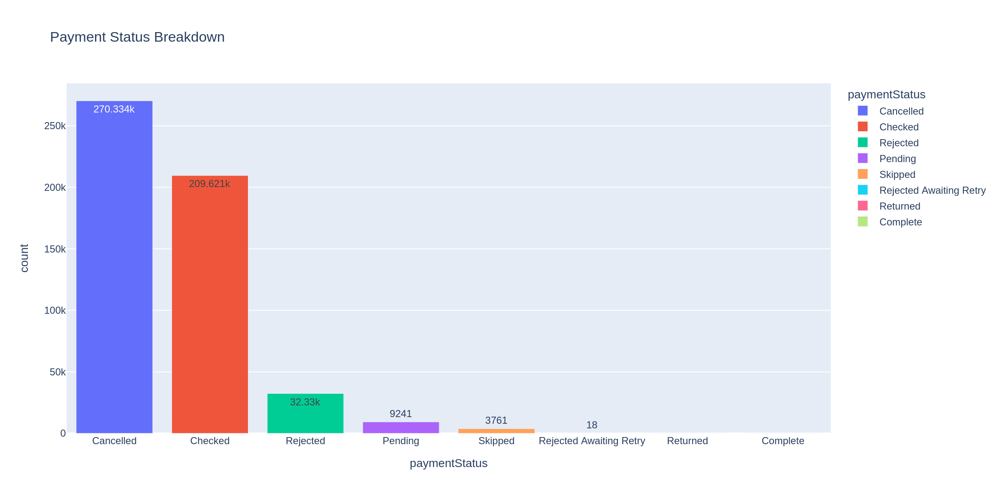

---

### Normal Payments vs Collection Plan Payments

Only 2% of payments went through a collection plan, confirming that most defaults result in outright loss rather than partial recovery.

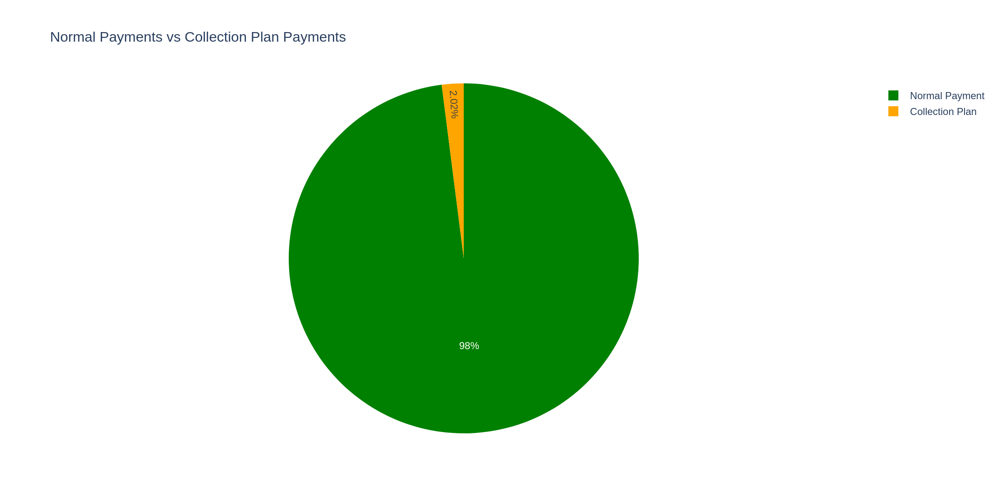

---

### Distribution of Number of Payments per Loan

Most loans average ~17 payments. A small tail of loans extends beyond 40+ payments, indicating restructured or long-running troubled loans.

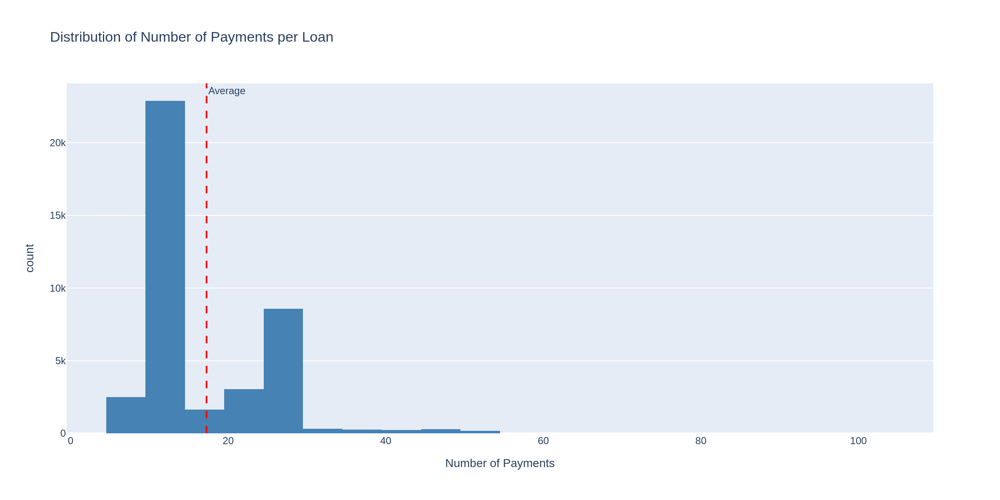

---

### Top 10 Reasons for Rejected Payments

Insufficient funds account for the overwhelming majority of rejections (22,865 cases) - dwarfing all other reasons combined.

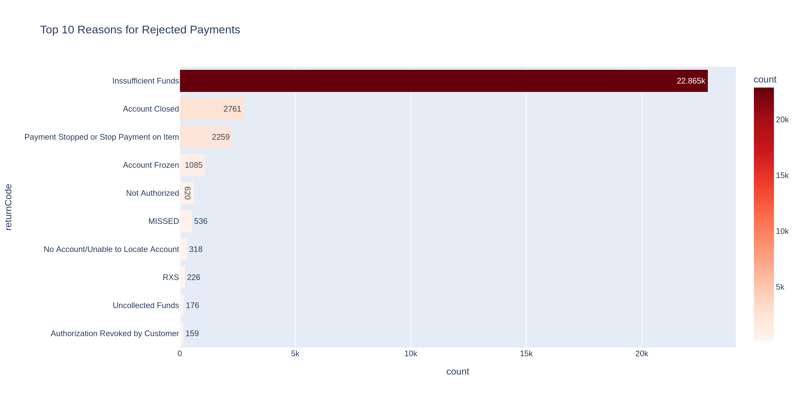

---

## ⚙️ Feature Engineering

Payment behaviour features were engineered from `payment.csv` and merged onto the loan dataset:

| Feature | Description |
|---------|-------------|
| `total_payments` | Total number of payment attempts per loan |
| `success_rate` | Ratio of successful payments to total attempts |
| `fpStatus` | Whether the first payment was approved or rejected |

> Two of the top four most predictive features (`success_rate`, `total_payments`) came from this engineered payment dataset - confirming that **payment behaviour history is a powerful signal**.

---

## 🤖 Models

Two classifiers were trained and compared:

### Logistic Regression (Baseline)
- Feature scaling applied (StandardScaler)
- Accuracy: **71%** | AUC-ROC: **0.786**
- Bad Loan Recall: **79%** | Good Loan Recall: **60%**

### Random Forest (Final Model)
- 100 estimators, no feature scaling required
- Accuracy: **74%** | AUC-ROC: **0.814**
- Bad Loan Recall: **80%** | Good Loan Recall: **64%**

Random Forest was selected as the production model as it outperforms Logistic Regression across every metric.

---

## 📈 Model Evaluation

### Top 15 Most Important Features

The strongest predictor is total scheduled payment amount (9.1%), followed by payment success rate and fraud score (~6.3% each). Two of the top four features were engineered from the payment dataset.

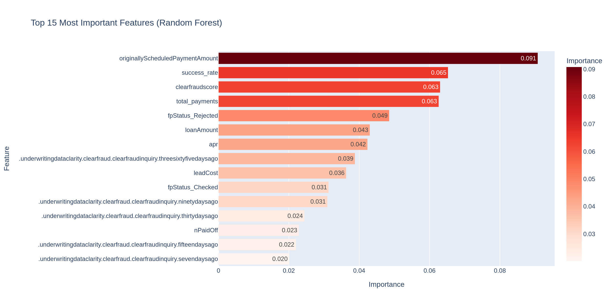

---

### Correlation Matrix (Top 15 Features)

`fpStatus_Checked` and `fpStatus_Rejected` show near-perfect negative correlation (-0.96) as expected. `loanAmount` and `originallyScheduledPaymentAmount` are almost perfectly correlated (0.95).

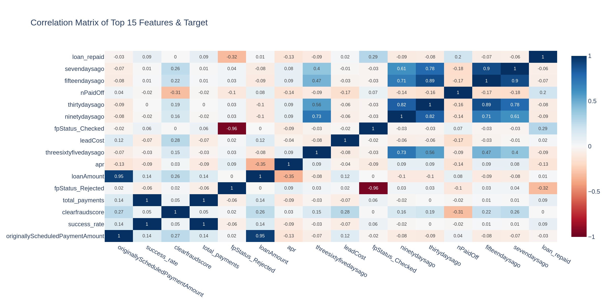

---

### Confusion Matrix (Random Forest)

Out of 3,682 actual bad loans, **2,947 (80%) were correctly flagged**. Only 735 slipped through undetected - an acceptable miss rate for a lending risk model.

.png)

---

### ROC Curve - Model Comparison

Both models significantly outperform random guessing. Random Forest (AUC = 0.814) consistently performs above Logistic Regression (AUC = 0.786) across all thresholds.

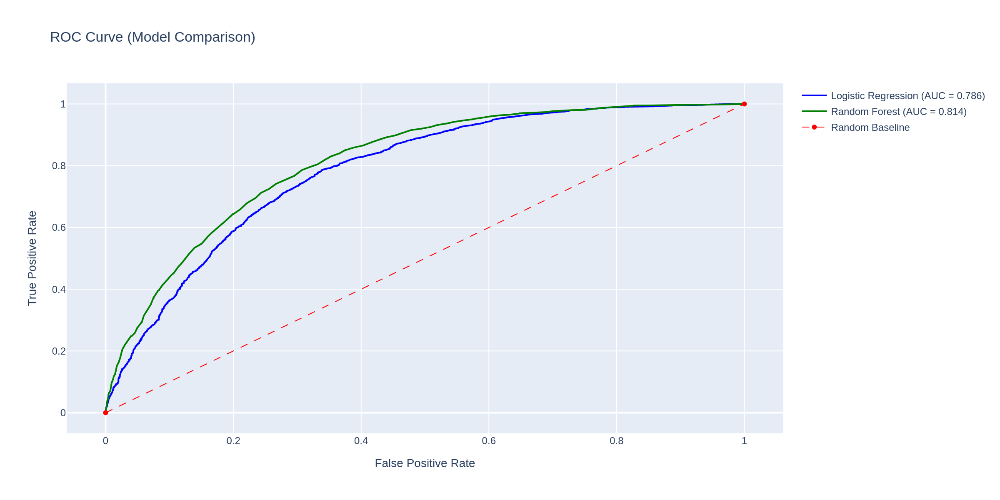

---

### Side-by-Side Model Comparison

Random Forest wins across every single metric - accuracy, AUC-ROC, bad loan recall, and good loan recall.

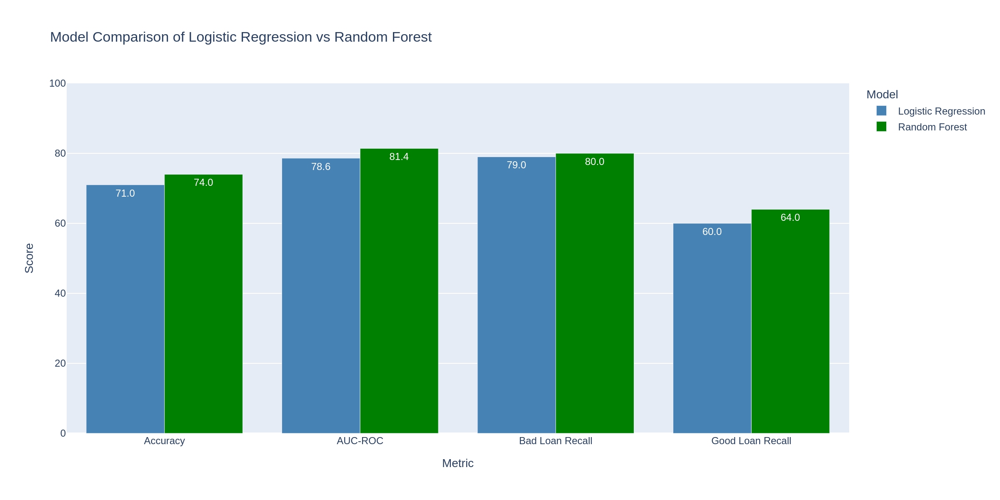

---

## 🏆 Key Findings

The top predictors of loan repayment:

1. **Total scheduled payment amount** - larger obligations correlate with more defaults
2. **Payment success rate** - borrowers with consistent payment history are far less risky
3. **Total payments made** - more payment attempts signals an active repayment journey
4. **First payment status** - if the first payment fails, the loan is very likely to default
5. **Fraud score** - third-party risk signals are strong predictors

---

## 💡 Recommendations

- Prioritise applicants with a proven payment history (returning customers)
- Immediately flag applications where the first payment fails for manual review
- Be cautious with high loan amounts relative to payment capacity
- Invest in Clarity underwriting checks for all applicants - background check data significantly improves prediction
- Treat weekly-payment borrowers as higher risk and price accordingly

---

## 🛠️ Tech Stack

| Library | Purpose |
|---------|---------|
| `pandas` | Data loading, merging, feature engineering |
| `scikit-learn` | Model training, evaluation, scaling |
| `plotly` | Interactive visualisations |
| `numpy` | Numerical operations |
